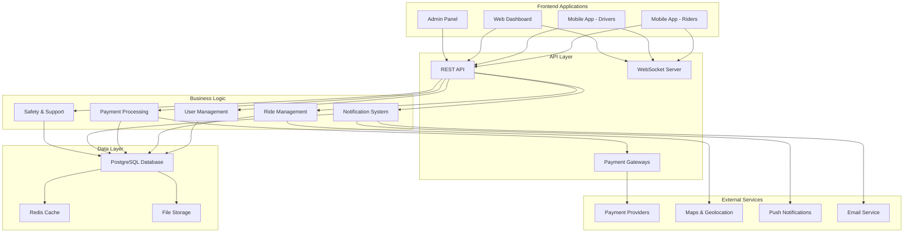
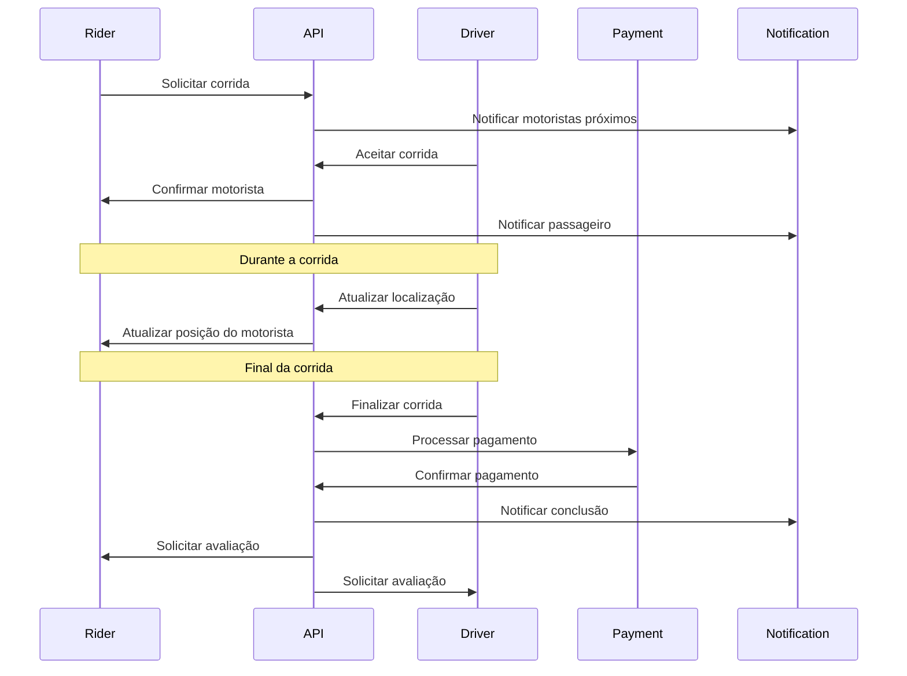
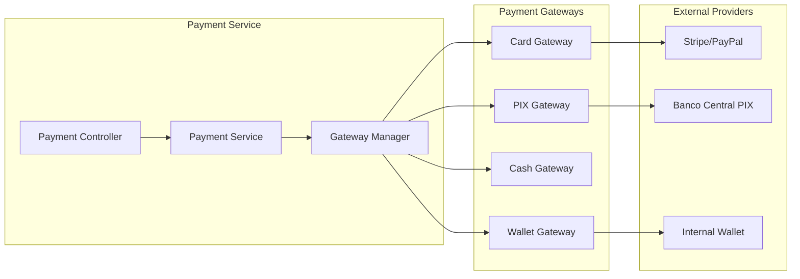

# 🚗 Zuber Mobility API

> **⚠️ Informação Pública**: Este é um repositório privado. Esta documentação é uma visão geral pública do projeto Zuber Mobility API.

API completa para sistema de mobilidade urbana - Zuber Mobility. Sistema de corridas, pagamentos, gestão de motoristas e passageiros com suporte a múltiplos métodos de pagamento e funcionalidades avançadas de segurança.

## 📋 Índice

- [Sobre o Projeto](#-sobre-o-projeto)
- [Funcionalidades](#-funcionalidades)
- [Tecnologias](#-tecnologias)
- [Arquitetura](#-arquitetura)
- [API Endpoints](#-api-endpoints)
- [Sistema de Permissões](#-sistema-de-permissões)
- [Contribuição](#-contribuição)
- [Licença](#-licença)
- [Contato](#-contato)

## 🎯 Sobre o Projeto

O Zuber Mobility API é uma solução completa para aplicações de mobilidade urbana, inspirada em plataformas como Uber e 99. O sistema oferece:

- **Gestão completa de usuários** (motoristas e passageiros)
- **Sistema de corridas em tempo real** com geolocalização
- **Múltiplos métodos de pagamento** (Cartão, PIX, Dinheiro, Carteira)
- **Sistema de avaliações e feedback**
- **Gestão de veículos e manutenção**
- **Suporte ao cliente integrado**
- **Relatórios de segurança**
- **Sistema de promoções e descontos**
- **Corridas agendadas**
- **Notificações em tempo real**

## ✨ Funcionalidades

### 🚗 Gestão de Corridas
- Criação e acompanhamento de corridas em tempo real
- Geolocalização e cálculo de rotas
- Sistema de preços dinâmicos
- Corridas agendadas
- Histórico completo de viagens

### 💳 Sistema de Pagamentos
- **Cartão de Crédito/Débito**: Integração com gateways de pagamento
- **PIX**: Pagamento instantâneo brasileiro
- **Dinheiro**: Pagamento em espécie
- **Carteira Digital**: Saldo interno da plataforma
- Sistema de comissões para motoristas
- Relatórios financeiros detalhados

### 👥 Gestão de Usuários
- Perfis diferenciados para motoristas e passageiros
- Sistema de verificação de documentos
- Histórico de corridas e avaliações
- Configurações de preferências

### 🚙 Gestão de Veículos
- Cadastro e verificação de veículos
- Registros de manutenção
- Inspeções de segurança
- Documentação digital

### 🛡️ Segurança e Qualidade
- Relatórios de segurança
- Sistema de denúncias
- Avaliações mútuas
- Monitoramento de qualidade

## 🛠️ Tecnologias

- **Backend**: Node.js 18+
- **Runtime**: Bun 1.0+
- **Banco de Dados**: PostgreSQL 13+
- **Linguagem**: TypeScript 5.0+
- **Autenticação**: JWT
- **Documentação**: Swagger/OpenAPI
- **Geolocalização**: Integração com APIs de mapas
- **Pagamentos**: Sistema de gateways extensível

## 🏛️ Arquitetura

### Fluxo de uma Corrida

### Sistema de Pagamentos

## 🔌 API Endpoints

### 👤 Usuários
- `GET /api/users` - Listar usuários
- `GET /api/users/:id` - Buscar usuário específico
- `POST /api/users` - Criar usuário
- `PUT /api/users/:id` - Atualizar usuário
- `DELETE /api/users/:id` - Deletar usuário

### 🚗 Motoristas
- `GET /api/profile-drivers` - Listar motoristas
- `GET /api/profile-drivers/:id` - Buscar motorista
- `POST /api/profile-drivers` - Cadastrar motorista
- `PUT /api/profile-drivers/:id` - Atualizar motorista

### 🚶 Passageiros
- `GET /api/profile-riders` - Listar passageiros
- `GET /api/profile-riders/:id` - Buscar passageiro
- `POST /api/profile-riders` - Cadastrar passageiro
- `PUT /api/profile-riders/:id` - Atualizar passageiro

### 🚕 Corridas
- `GET /api/rides` - Listar corridas
- `GET /api/rides/:id` - Buscar corrida
- `POST /api/rides` - Solicitar corrida
- `PUT /api/rides/:id` - Atualizar corrida
- `POST /api/rides/:id/accept` - Aceitar corrida
- `POST /api/rides/:id/start` - Iniciar corrida
- `POST /api/rides/:id/finish` - Finalizar corrida

### 💳 Pagamentos
- `GET /api/payments` - Listar pagamentos
- `GET /api/payments/:id` - Buscar pagamento
- `POST /api/payments` - Processar pagamento
- `POST /api/payments/:id/refund` - Reembolsar pagamento

### ⭐ Avaliações
- `GET /api/ratings` - Listar avaliações
- `POST /api/ratings` - Criar avaliação
- `GET /api/ratings/user/:userId` - Avaliações de um usuário

### 🎯 Promoções
- `GET /api/promotions` - Listar promoções
- `POST /api/promotions` - Criar promoção
- `POST /api/promotions/validate` - Validar cupom

### 🔔 Notificações
- `GET /api/notifications` - Listar notificações
- `POST /api/notifications` - Enviar notificação
- `PUT /api/notifications/:id/read` - Marcar como lida

### 🎫 Suporte
- `GET /api/support-tickets` - Listar tickets
- `POST /api/support-tickets` - Abrir ticket
- `PUT /api/support-tickets/:id` - Atualizar ticket

### 🛡️ Segurança
- `GET /api/safety-reports` - Listar relatórios
- `POST /api/safety-reports` - Criar relatório
- `PUT /api/safety-reports/:id` - Atualizar relatório

### 📅 Corridas Agendadas
- `GET /api/scheduled-rides` - Listar corridas agendadas
- `POST /api/scheduled-rides` - Agendar corrida
- `PUT /api/scheduled-rides/:id` - Atualizar agendamento

### 🚙 Veículos
- `GET /api/vehicles` - Listar veículos
- `POST /api/vehicles` - Cadastrar veículo
- `PUT /api/vehicles/:id` - Atualizar veículo

### 🏠 Endereços
- `GET /api/addresses` - Listar endereços
- `POST /api/addresses` - Cadastrar endereço
- `PUT /api/addresses/:id` - Atualizar endereço

## 🔐 Sistema de Permissões

### Roles Principais

1. **admin** - Acesso total ao sistema
2. **rider** - Passageiros
3. **driver** - Motoristas
4. **support** - Equipe de suporte
5. **moderator** - Moderadores
6. **financial** - Equipe financeira
7. **safety** - Equipe de segurança

### Permissões por Módulo

Cada role possui permissões específicas para:
- **users**: Gerenciar usuários
- **vehicles**: Gerenciar veículos
- **rides**: Gerenciar corridas
- **ratings**: Gerenciar avaliações
- **scheduled-rides**: Gerenciar corridas agendadas
- **payments**: Gerenciar pagamentos
- **promotions**: Gerenciar promoções
- **notifications**: Gerenciar notificações
- **support**: Gerenciar suporte
- **safety**: Gerenciar relatórios de segurança
- **addresses**: Gerenciar endereços
- **maintenance**: Gerenciar manutenção
- **inspection**: Gerenciar inspeções

## 📊 Estrutura de Dados

### Principais Entidades

- **Users**: Usuários base do sistema
- **ProfileDrivers**: Perfis específicos de motoristas
- **ProfileRiders**: Perfis específicos de passageiros
- **Vehicles**: Veículos dos motoristas
- **Rides**: Corridas do sistema
- **Payments**: Transações financeiras
- **Ratings**: Avaliações mútuas
- **Promotions**: Cupons e descontos
- **Notifications**: Notificações do sistema
- **SupportTickets**: Tickets de suporte
- **SupportMessages**: Mensagens de suporte
- **SafetyReports**: Relatórios de segurança
- **ScheduledRides**: Corridas agendadas
- **Addresses**: Endereços dos usuários
- **MaintenanceRecords**: Registros de manutenção
- **InspectionRecords**: Registros de inspeção
- **DriverEarnings**: Ganhos dos motoristas
- **FareSettings**: Configurações de tarifas

## 🚀 Características Técnicas

- **API RESTful** com documentação Swagger
- **Autenticação JWT** com refresh tokens
- **Validação de dados** em todas as rotas
- **Paginação** em todas as listagens
- **Filtros avançados** por múltiplos critérios
- **Sistema de logs** detalhado
- **Rate limiting** para proteção contra abuso
- **CORS configurável** para diferentes origens
- **Compressão gzip** para otimização
- **Cache Redis** para performance
- **Upload de arquivos** com validação
- **WebSockets** para comunicação em tempo real

## 🤝 Contribuição

Este é um repositório privado. Para contribuições ou dúvidas, entre em contato através dos canais oficiais.

## 📄 Licença

Este projeto está licenciado sob a Licença MIT - veja o arquivo [LICENSE](LICENSE) para detalhes.

## 📞 Contato

**DanSP** - [@dansp89](https://t.me/dansp89) - daniel.rootdir@gmail.com

**Links do Projeto**:
- [Repositório](https://github.com/dansp89/zuber-mobility-api)
- [Issues](https://github.com/dansp89/zuber-mobility-api/issues)

---

  
Feito com ❤️ no Brasil 🇧🇷

  
Zuber Mobility API - Revolucionando a mobilidade urbana

 
